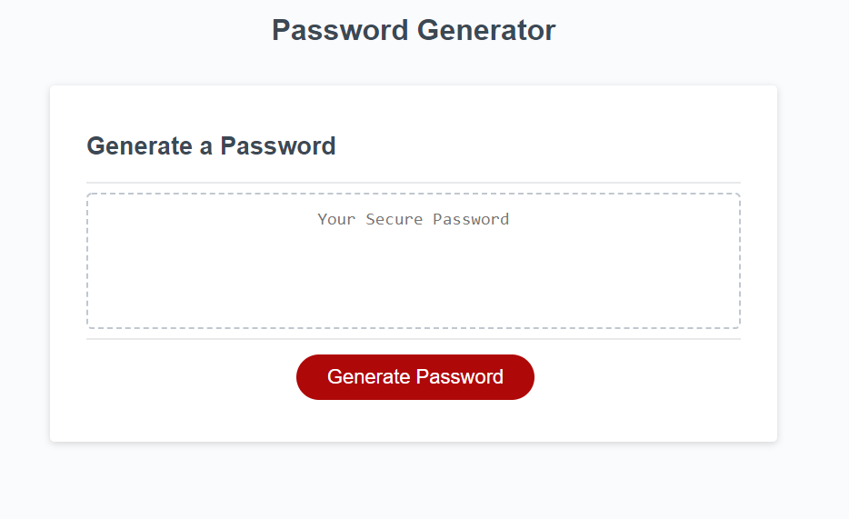
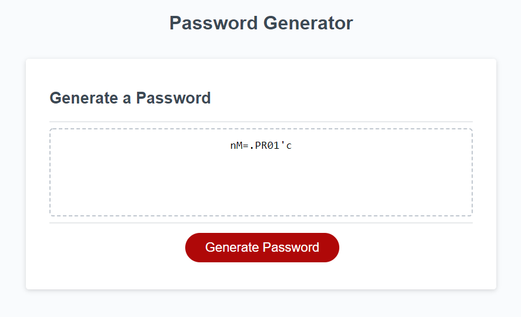

# Password Generator

# Description
This is the 3rd challende for the Web Development bootcamp where I have created a password generator that can be used by a user to create a password that can contain spcial characters, lower case, upper case, variable length between 8-128 characters, and numbers. The user will follow a series of prompts and based off of these prompts generate a password that will for the instructions the user has given.

# Difficulties
I struggled with creating a functions that interacted appropriately with the chosen prompts that the user can select to accuratley display what the user wanted within their password. I had to reach out to other students in the bootcamp to combat this and their help was tremendous. This resulted in me having to create another repository where I had to move majority of my previous code from earlier attempts in to this one.

# URLS containin Repository and Publish site

published: https://syrusfarris.github.io/password-generator/
Repository: https://github.com/SyrusFarris/password-generator

# User Story
AS AN employee with access to sensitive data
I WANT to randomly generate a password that meets certain criteria
SO THAT I can create a strong password that provides greater security

# Acceptance Criteria
GIVEN I need a new, secure password
WHEN I click the button to generate a password
THEN I am presented with a series of prompts for password criteria
WHEN prompted for password criteria
THEN I select which criteria to include in the password
WHEN prompted for the length of the password
THEN I choose a length of at least 8 characters and no more than 128 characters
WHEN asked for character types to include in the password
THEN I confirm whether or not to include lowercase, uppercase, numeric, and/or special characters
WHEN I answer each prompt
THEN my input should be validated and at least one character type should be selected
WHEN all prompts are answered
THEN a password is generated that matches the selected criteria
WHEN the password is generated
THEN the password is either displayed in an alert or written to the page

# Screenshots of working code 

